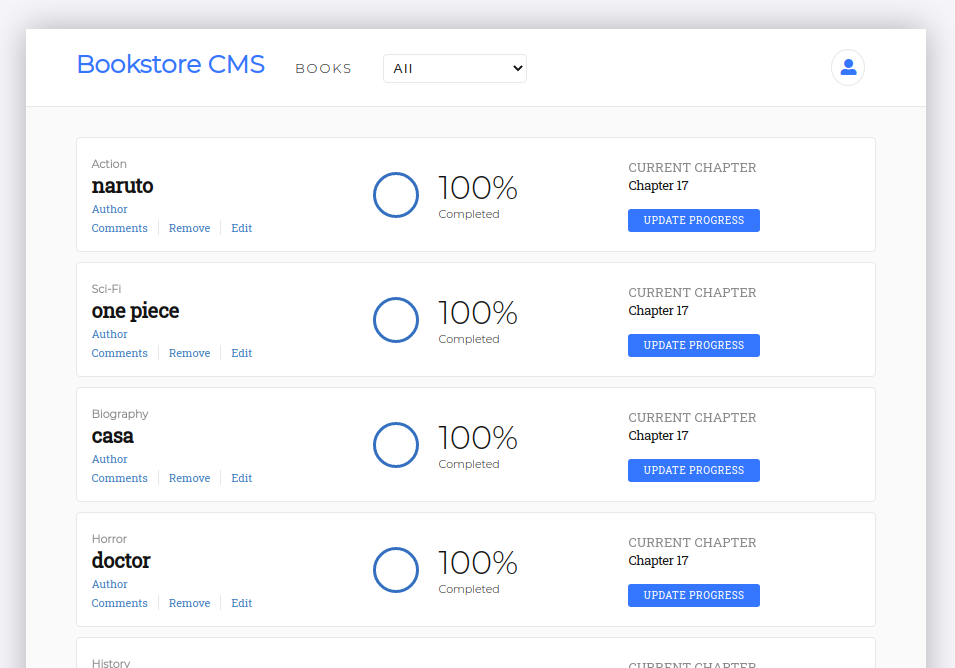

A cool Book store built with react and redux

## Built With

This app was built with:

- React
- Redux
- JavaScript, HTML & CSS
- Create-react-app
- Proptypes

## Live Demo

[Live link here](magikbooks.herokuapp.com/)

## Getting Started

To get a local copy up and running follow these simple example steps.

### Prerequisites

Have a browser installed

### Setup

Clone this repo with <code>git clone git@github.com:ericmbouwe/magikbooks.git</code>

### Usage

1. <code>cd</code> into the project directory
2. run <code>npm install</code>

## Available Scripts

In the project directory, you can run:

### `npm start`

Runs the app in the development mode. 
Open [http://localhost:3000](http://localhost:3000) to view it in the browser and enjoy :smiley:.

The page will reload if you make edits. 
You will also see any lint errors in the console.

### `npm run build`

Builds the app for production to the `build` folder. 
It correctly bundles React in production mode and optimizes the build for the best performance.

The build is minified and the filenames include the hashes. 

## Authors

:bust_in_silhouette: **Eric Mbouwe**

- Github: [ericmbouwe](https://www.github.com/ericmbouwe)
- LinkedIn: [Eric Mbouwe](https://www.linkedin.com/in/ericmbouwe)

## 🤝 Contributing

Contributions, issues and feature requests are welcome!

Feel free to check the [issues page](https://github.com/ericmbouwe/magikbooks/issues).

## Show your support

Give a ⭐️ if you like this project!

## Acknowledgments

- FreeCodeCamp
- WebSimplified
- The Net NInja

## 📝 License

This project is [MIT](lic.url) licensed.
